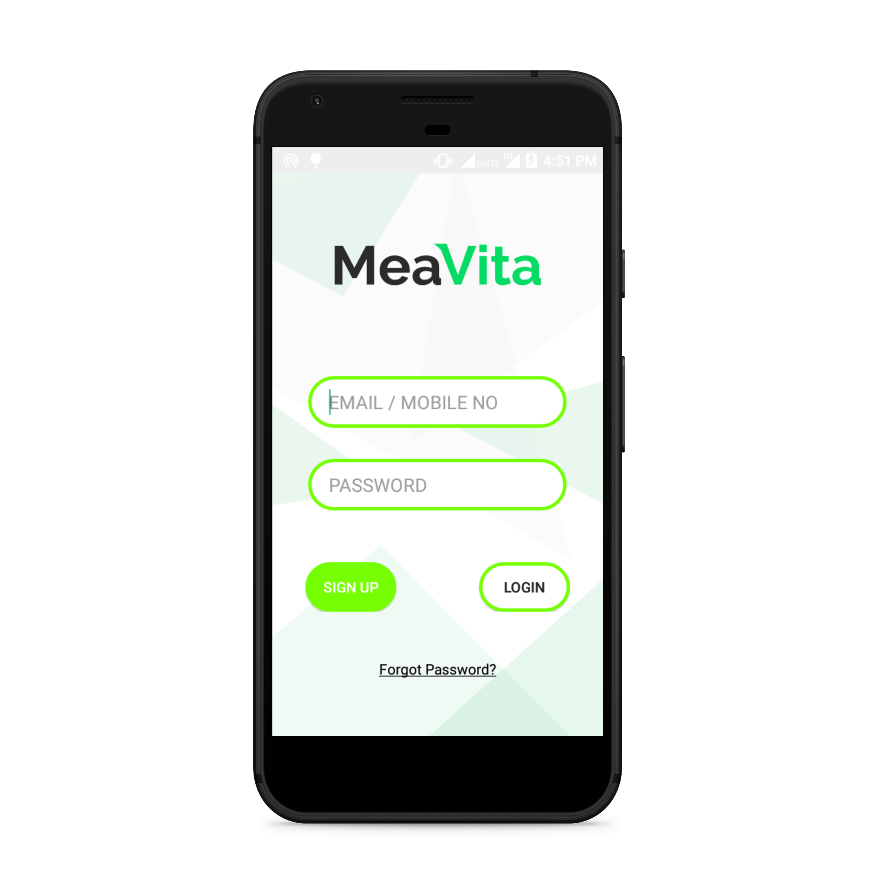

# MeaVita
MeaVita was a work-in-progress application which aims to provide access to all your accounts at a single place.

# About the company
The app was developed as a research/viability-testing project for the company - Intellinects Ventures. More details about the company can be found on: http://intellinects.com

# Application screenshots

</img>

</img> 
</img>
</img>

# Download link
The app can be downloaded from the given link: https://drive.google.com/open?id=0B_KFChxLPJ41aldsalhObE9tRHc

# Work to be completed
Being a research project, this was a sample application developed to test out the designs and as well as the integration with the Facebook APIs. This means that some other core functionality such as registering and logging in with a user account was not implemented.
